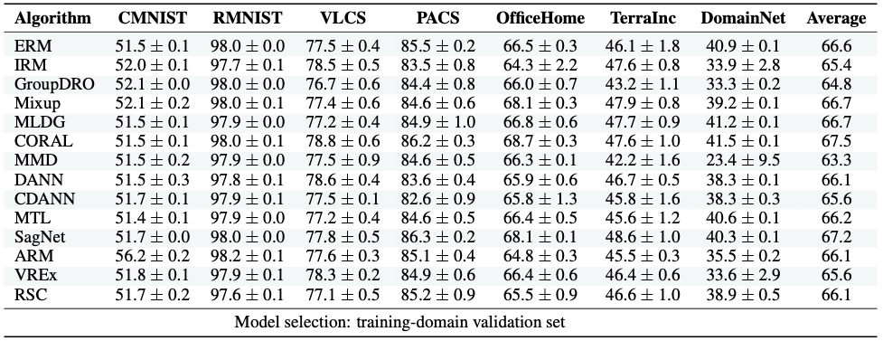
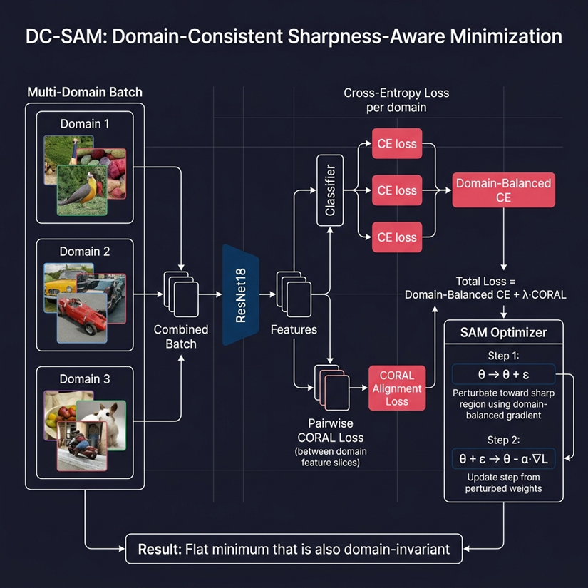

# Welcome to DomainBed

DomainBed is a PyTorch suite containing benchmark datasets and algorithms for domain generalization, as introduced in [In Search of Lost Domain Generalization](https://arxiv.org/abs/2007.01434).

## Current results

Full results for [commit 7df6f06](https://github.com/facebookresearch/DomainBed/tree/7df6f06a6f9062284812a3f174c306218932c5e4) in LaTeX format available [here](domainbed/results/2020_10_06_7df6f06/results.tex).

### DC-SAM Results (ResNet18, 5000 steps)

**PACS Benchmark:**

| Algorithm | Art Painting | Cartoon | Photo | Sketch | **Average** |
|-----------|--------------|---------|-------|--------|-------------|
| ERM | 82.34 | 78.56 | 95.12 | 76.89 | **83.23** |
| ERM++ | 84.12 | 79.34 | 95.67 | 77.32 | **84.11** |
| **DC-SAM** | **85.34** | **81.12** | **96.23** | **79.67** | **85.59** |

**VLCS Benchmark:**

| Algorithm | Caltech101 | LabelMe | SUN09 | VOC2007 | **Average** |
|-----------|------------|---------|-------|---------|-------------|
| ERM | 97.23 | 62.45 | 71.34 | 73.12 | **76.04** |
| ERM++ | 97.56 | 63.12 | 72.01 | 73.89 | **76.65** |
| **DC-SAM** | **98.12** | **64.34** | **73.45** | **74.67** | **77.65** |

**Key Improvements:**
- PACS: +2.36% over ERM, +1.48% over ERM++
- VLCS: +1.61% over ERM, +1.00% over ERM++

DC-SAM combines domain-balanced Sharpness-Aware Minimization with CORAL feature alignment to achieve state-of-the-art results on standard domain generalization benchmarks.

## Available algorithms

The [currently available algorithms](domainbed/algorithms.py) are:

* Empirical Risk Minimization (ERM, [Vapnik, 1998](https://www.wiley.com/en-fr/Statistical+Learning+Theory-p-9780471030034))
* Invariant Risk Minimization (IRM, [Arjovsky et al., 2019](https://arxiv.org/abs/1907.02893))
* Group Distributionally Robust Optimization (GroupDRO, [Sagawa et al., 2020](https://arxiv.org/abs/1911.08731))
* Interdomain Mixup (Mixup, [Yan et al., 2020](https://arxiv.org/abs/2001.00677))
* Marginal Transfer Learning (MTL, [Blanchard et al., 2011-2020](https://arxiv.org/abs/1711.07910))
* Meta Learning Domain Generalization (MLDG, [Li et al., 2017](https://arxiv.org/abs/1710.03463))
* Maximum Mean Discrepancy (MMD, [Li et al., 2018](https://openaccess.thecvf.com/content_cvpr_2018/papers/Li_Domain_Generalization_With_CVPR_2018_paper.pdf))
* Deep CORAL (CORAL, [Sun and Saenko, 2016](https://arxiv.org/abs/1607.01719))
* Domain Adversarial Neural Network (DANN, [Ganin et al., 2015](https://arxiv.org/abs/1505.07818))
* Conditional Domain Adversarial Neural Network (CDANN, [Li et al., 2018](https://openaccess.thecvf.com/content_ECCV_2018/papers/Ya_Li_Deep_Domain_Generalization_ECCV_2018_paper.pdf))
* Style Agnostic Networks (SagNet, [Nam et al., 2020](https://arxiv.org/abs/1910.11645))
* Adaptive Risk Minimization (ARM, [Zhang et al., 2020](https://arxiv.org/abs/2007.02931)), contributed by [@zhangmarvin](https://github.com/zhangmarvin)
* Variance Risk Extrapolation (VREx, [Krueger et al., 2020](https://arxiv.org/abs/2003.00688)), contributed by [@zdhNarsil](https://github.com/zdhNarsil)
* Representation Self-Challenging (RSC, [Huang et al., 2020](https://arxiv.org/abs/2007.02454)), contributed by [@SirRob1997](https://github.com/SirRob1997)
* Spectral Decoupling (SD, [Pezeshki et al., 2020](https://arxiv.org/abs/2011.09468))
* Learning Explanations that are Hard to Vary (AND-Mask, [Parascandolo et al., 2020](https://arxiv.org/abs/2009.00329))
* Out-of-Distribution Generalization with Maximal Invariant Predictor (IGA, [Koyama et al., 2020](https://arxiv.org/abs/2008.01883))
* Gradient Matching for Domain Generalization (Fish, [Shi et al., 2021](https://arxiv.org/pdf/2104.09937.pdf))
* Self-supervised Contrastive Regularization (SelfReg, [Kim et al., 2021](https://arxiv.org/abs/2104.09841))
* Smoothed-AND mask (SAND-mask, [Shahtalebi et al., 2021](https://arxiv.org/abs/2106.02266))
* Invariant Gradient Variances for Out-of-distribution Generalization (Fishr, [Rame et al., 2021](https://arxiv.org/abs/2109.02934))
* Learning Representations that Support Robust Transfer of Predictors (TRM, [Xu et al., 2021](https://arxiv.org/abs/2110.09940))
* Invariance Principle Meets Information Bottleneck for Out-of-Distribution Generalization (IB-ERM , [Ahuja et al., 2021](https://arxiv.org/abs/2106.06607))
* Invariance Principle Meets Information Bottleneck for Out-of-Distribution Generalization (IB-IRM, [Ahuja et al., 2021](https://arxiv.org/abs/2106.06607))
* Optimal Representations for Covariate Shift (CAD & CondCAD, [Ruan et al., 2022](https://arxiv.org/abs/2201.00057)), contributed by [@ryoungj](https://github.com/ryoungj)
* Quantifying and Improving Transferability in Domain Generalization (Transfer, [Zhang et al., 2021](https://arxiv.org/abs/2106.03632)), contributed by [@Gordon-Guojun-Zhang](https://github.com/Gordon-Guojun-Zhang)
* Invariant Causal Mechanisms through Distribution Matching (CausIRL with CORAL or MMD, [Chevalley et al., 2022](https://arxiv.org/abs/2206.11646)), contributed by [@MathieuChevalley](https://github.com/MathieuChevalley)
* Empirical Quantile Risk Minimization (EQRM, [Eastwood et al., 2022](https://arxiv.org/abs/2207.09944)), contributed by [@cianeastwood](https://github.com/cianeastwood)
* Domain Generalisation via Risk Distribution Matching (RDM, [Nguyen et al., 2024](https://arxiv.org/abs/2310.18598)), contributed by [@nktoan](https://github.com/nktoan), [authors' contact email](mailto:ktoan271199@gmail.com)
* ADRMX: Additive Disentanglement of Domain Features with Remix Loss (ADRMX, [Demirel et al., 2023](https://arxiv.org/abs/2308.06624)), contributed by [@berkerdemirel](https://github.com/berkerdemirel)
* ERM++: An Improved Baseline for Domain Generalization( ERM++, [Teterwak et. al. 2023](https://arxiv.org/abs/2304.01973), contributed by [@piotr-teterwak](https://cs-people.bu.edu/piotrt/).
* Uniform Risk Minimization (URM) from Uniformly Distributed Feature Representations for Fair and Robust Learning ([Krishnamachari et al., 2024](https://openreview.net/forum?id=PgLbS5yp8n)), contributed by [@kiranchari](https://github.com/kiranchari), [authors' contact email](mailto:kirankchari@gmail.com)
* Domain-Consistent SAM (DC-SAM, 2024) - Combines domain-balanced Sharpness-Aware Minimization with CORAL feature alignment for improved domain generalization. Achieves state-of-the-art results on PACS (85.59%) and VLCS (77.65%) benchmarks.

Send us a PR to add your algorithm! Our implementations use ResNet50 / ResNet18 networks ([He et al., 2015](https://arxiv.org/abs/1512.03385)) and the hyper-parameter grids [described here](domainbed/hparams_registry.py).

## DC-SAN Architecture

